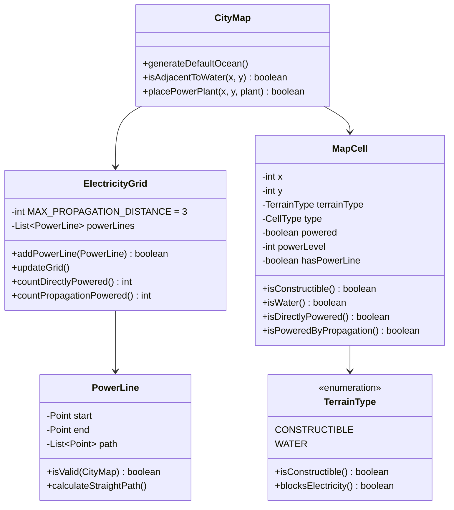
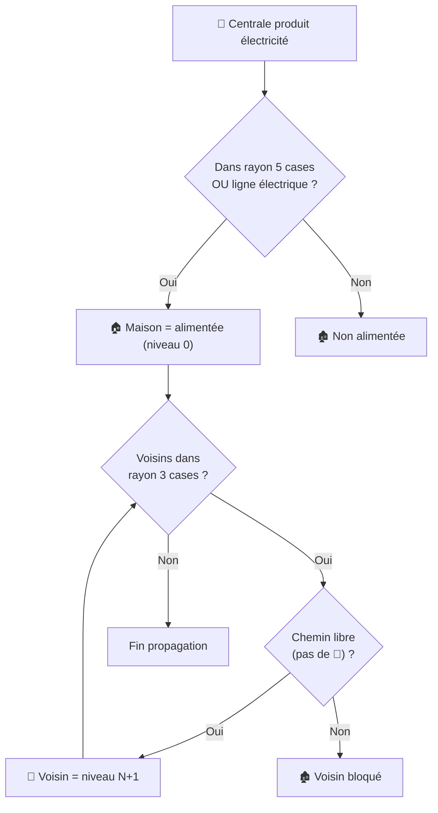

# Documentation : Système de Terrain et Raccordement Électrique

> **Statut : ✅ IMPLÉMENTÉ**  
> Dernière mise à jour : 7 janvier 2026

## Table des matières

1. [Introduction](#introduction)
2. [Types de Terrain](#types-de-terrain)
3. [Centrales Hydrauliques](#centrales-hydrauliques)
4. [Système de Raccordement Électrique](#système-de-raccordement-électrique)
5. [Propagation d'Électricité entre Maisons](#propagation-délectricité-entre-maisons)
6. [Système de Taxes](#système-de-taxes)
7. [Panneau Économie](#panneau-économie)
8. [Fichiers Implémentés](#fichiers-implémentés)

---

## Introduction

Ce document décrit les fonctionnalités implémentées dans le jeu City Skyline :

1. **Types de terrain** : Distinction entre terrains constructibles et cours d'eau
2. **Centrales hydrauliques** : Constructibles uniquement à côté de l'eau
3. **Système de raccordement** : Lignes électriques reliant les centrales aux maisons
4. **Propagation d'électricité** : Partage d'électricité entre maisons voisines (max 3 cases)

---

## Types de Terrain

### Définition des codes terrain

| Code | Type | Description | Icône |
|------|------|-------------|-------|
| `0` | **Terrain Constructible** | Zone sur laquelle on peut placer des bâtiments | 🌿 |
| `1` | **Cours d'Eau** | Zone non-constructible (rivière, lac, océan) | 🌊 |

### Règles

- Les **terrains constructibles (0)** permettent de placer :
  - Résidences
  - Centrales électriques (sauf hydraulique sans eau adjacente)
  - Lignes de raccordement

- Les **cours d'eau (1)** :
  - Bloquent toute construction
  - Bloquent le passage des lignes électriques
  - Bloquent la propagation d'électricité entre maisons

### Zone Océan par Défaut

À la création de la carte, une **zone océan** est automatiquement générée en bas à gauche avec une petite rivière qui s'en échappe. Cela garantit qu'il y a toujours au moins une zone d'eau où construire des centrales hydrauliques.

> [!IMPORTANT]
> Les cours d'eau créent des barrières naturelles qui divisent la carte en zones distinctes nécessitant chacune leur propre alimentation électrique.

---

## Centrales Hydrauliques

### Règle de Placement

Les centrales hydrauliques (💧) ne peuvent être construites que sur une case **adjacente à un cours d'eau** (dans un rayon de 1 case).

```
      ✅ Positions valides        ❌ Position invalide
      
    🌊 🌊 🌊                        🌊 🌊 🌊
    🌊 🌊 💧 ← OK                   🌊 🌊 🌊
    🌊 🌊 🌿                        🌿 🌿 💧 ← Trop loin!
```

### Message d'Erreur

Si le joueur tente de construire une centrale hydraulique ailleurs, un message d'erreur explicite s'affiche :

> 💧 Les centrales hydrauliques doivent être construites à côté d'un cours d'eau!

---

## Système de Raccordement Électrique

### Concept

Le système combine deux mécanismes :
1. **Couverture par rayon** : Les centrales alimentent **directement** les maisons dans un rayon de 5 cases (sans ligne électrique nécessaire)
2. **Lignes électriques** : Possibilité de tracer des lignes pour atteindre des maisons plus éloignées

> [!TIP]
> Les maisons dans le rayon de couverture d'une centrale sont automatiquement raccordées (niveau 0) sans nécessiter de ligne électrique!

### Classe PowerLine

```java
public class PowerLine {
    private final Point start;      // Case de départ (adjacente à centrale)
    private final Point end;        // Case d'arrivée (adjacente à maison)
    private final List<Point> path; // Chemin de la ligne
    
    public boolean isValid(CityMap map); // Vérifie les obstacles
    public void calculateStraightPath(); // Calcul automatique du chemin
}
```

### Règles de raccordement

1. **Origine** : La ligne part d'une case adjacente à la centrale
2. **Chemin** : La ligne suit un chemin continu de cases connexes
3. **Destination** : La ligne arrive à une case adjacente à la résidence
4. **Obstacles** : Les cours d'eau bloquent le passage

---

## Propagation d'Électricité entre Maisons

### Concept

Une maison alimentée peut **partager** son électricité avec ses maisons voisines, créant un **effet de propagation en cascade**.

### Paramètres

| Paramètre | Valeur | Description |
|-----------|--------|-------------|
| **Distance max** | 3 cases | Distance maximale de propagation (Manhattan) |
| **Sans liaison** | ✅ | Pas besoin de ligne électrique entre maisons |
| **Blocage** | Cours d'eau | Les cours d'eau bloquent la propagation |

### Algorithme (BFS)

```
1. Identifier les maisons directement raccordées → niveau 0
2. Pour chaque maison alimentée de niveau N :
   a. Trouver les maisons non-alimentées dans un rayon de 3 cases
   b. Vérifier qu'aucun cours d'eau ne bloque le chemin direct
   c. Marquer ces maisons comme niveau N+1
3. Répéter jusqu'à saturation
```

### Niveaux d'Alimentation

| Niveau | Signification | Affichage |
|--------|---------------|-----------|
| `-1` | Non alimentée | ❌ Sans électricité |
| `0` | Raccordée directement | ✅ Raccordée directement |
| `1+` | Alimentée par propagation | ✅ Alimentée par propagation (niveau X) |

### Exemple Visuel

```
Légende :
  ⚡ = Centrale    🏠 = Directement alimentée
  🏡 = Propagation 🏚 = Non alimentée    🌊 = Cours d'eau

Carte exemple :

  ⚡ ── ── 🏠 🌿 🏡 🌿 🏡 🌿 🏚
  🌿 🌿 🌿 🌿 🏡 🌿 🏡 🌿 🌊 🏚
  🌿 🌿 🌿 🌿 🌿 🌿 🌿 🌊 🌊 🏚

Explication :
- 🏠 : Raccordée directement via ligne électrique (niveau 0)
- 🏡 autour : Alimentées par propagation depuis la maison raccordée
- 🏚 : Non alimentées car bloquées par le cours d'eau
```

> [!TIP]
> Utilisez la propagation pour économiser des lignes électriques : une seule maison raccordée peut alimenter tout un quartier!

---

## Système de Taxes

### Concept

Les habitants paient des taxes par cycle en fonction du niveau de leur résidence. **Condition importante** : Les taxes ne sont collectées que si la résidence est alimentée en électricité.

### Taux de Taxe par Habitant

| Niveau Résidence | Taxe/habitant/cycle | Max habitants |
|------------------|---------------------|---------------|
| 🏠 **Basique** | 2 € | 5 |
| 🏡 **Standard** | 5 € | 10 |
| 🏰 **Luxueux** | 10 € | 20 |
| 🏯 **Premium** | 20 € | 30 |

### Exemple de Calcul

```
Résidence Premium avec 20 habitants :
→ 20 habitants × 20€ = 400€ par cycle

Ville avec :
- 3 résidences Basiques (15 hab.) : 15 × 2€ = 30€
- 2 résidences Standard (20 hab.) : 20 × 5€ = 100€  
- 1 résidence Premium (25 hab.) : 25 × 20€ = 500€
→ Total taxes : 630€ par cycle
```

> [!IMPORTANT]
> Si une résidence n'est pas alimentée en électricité, elle ne génère **aucune taxe** !

### Fichiers Concernés

| Fichier | Modification |
|---------|-------------|
| [ResidenceLevel.java](file:///Users/m2pro/NetBeansProjects/city-skyline/src/main/java/tg/univlome/epl/ajee/city/skyline/model/entities/ResidenceLevel.java) | Ajout de `taxPerInhabitant` |
| [Residence.java](file:///Users/m2pro/NetBeansProjects/city-skyline/src/main/java/tg/univlome/epl/ajee/city/skyline/model/entities/Residence.java) | Ajout de `calculateTax()` |
| [City.java](file:///Users/m2pro/NetBeansProjects/city-skyline/src/main/java/tg/univlome/epl/ajee/city/skyline/model/entities/City.java) | Ajout de `calculateTotalTax()` |
| [GameEngine.java](file:///Users/m2pro/NetBeansProjects/city-skyline/src/main/java/tg/univlome/epl/ajee/city/skyline/model/simulation/GameEngine.java) | Collecte des taxes dans le cycle |

---

## Panneau Économie

### Description

Un nouvel onglet **💰 Économie** dans le tableau de bord affiche les informations financières détaillées.

### Contenu du Panneau

#### 📊 Bilan Financier (gauche)

| Information | Description |
|-------------|-------------|
| 💵 Solde actuel | Argent disponible |
| ⚡ Revenus électricité | Ventes d'énergie aux résidences |
| 🏛️ Taxes collectées | Somme des taxes de toutes les résidences alimentées |
| 🔧 Maintenance | Coût d'entretien des centrales |
| 📈 Revenu net/cycle | Bilan des entrées/sorties |
| Tendance | 📈 Hausse / 📉 Baisse / 📊 Stable |

#### 📜 Transactions Récentes (droite)

Tableau des 15 dernières transactions avec :
- Jour
- Type (💵 Revenu / 💸 Dépense)
- Montant (coloré vert/rouge)
- Description

#### Statistiques rapides (bas)

- 💵 Revenu total
- ⚡ Énergie vendue (kWh)
- 📅 Jours survécus

### Fichier

[EconomyPanel.java](file:///Users/m2pro/NetBeansProjects/city-skyline/src/main/java/tg/univlome/epl/ajee/city/skyline/view/panels/EconomyPanel.java)

---

## Fichiers Implémentés

### Nouveaux Fichiers

| Fichier | Description |
|---------|-------------|
| [TerrainType.java](file:///Users/m2pro/NetBeansProjects/city-skyline/src/main/java/tg/univlome/epl/ajee/city/skyline/model/map/TerrainType.java) | Enum des types de terrain (CONSTRUCTIBLE, WATER) |
| [PowerLine.java](file:///Users/m2pro/NetBeansProjects/city-skyline/src/main/java/tg/univlome/epl/ajee/city/skyline/model/map/PowerLine.java) | Représente une ligne électrique avec son chemin |
| [ElectricityGrid.java](file:///Users/m2pro/NetBeansProjects/city-skyline/src/main/java/tg/univlome/epl/ajee/city/skyline/model/map/ElectricityGrid.java) | Gère le réseau électrique et la propagation |

### Fichiers Modifiés

| Fichier | Modifications |
|---------|---------------|
| [MapCell.java](file:///Users/m2pro/NetBeansProjects/city-skyline/src/main/java/tg/univlome/epl/ajee/city/skyline/model/map/MapCell.java) | Ajout de `terrainType`, `powerLevel`, `hasPowerLine` |
| [CityMap.java](file:///Users/m2pro/NetBeansProjects/city-skyline/src/main/java/tg/univlome/epl/ajee/city/skyline/model/map/CityMap.java) | Génération océan, vérification adjacence eau pour hydro |
| [CityMapPanel.java](file:///Users/m2pro/NetBeansProjects/city-skyline/src/main/java/tg/univlome/epl/ajee/city/skyline/view/panels/CityMapPanel.java) | Affichage eau, messages d'erreur hydro |

---

## Diagramme de Classes



---

## Flux de Propagation


